# Smart Health Platform - Frontend

[中文文档](./README_CH.md) | [English Document](#english-document)

---

<div align="left">
  
  
  
  
  
  
  
  
</div>


### Project Overview

Smart Health Platform Frontend is a modern, responsive web application built with Vue 3 and Composition API. It provides an intuitive interface for users to manage their health data, track nutrition, receive medication reminders, and engage with a health-focused community.

**Key Features:**

- Responsive dashboard with real-time health metrics visualization
- Interactive data charts using ECharts
- AI-powered health assistant chatbot
- Rich text editor for community posts
- Real-time medication reminders via WebSocket
- Mobile-optimized responsive design
- Smooth animations and modern UI/UX

### System Screenshots

<div align="center">

#### 🏠 Dashboard - Health Data Overview
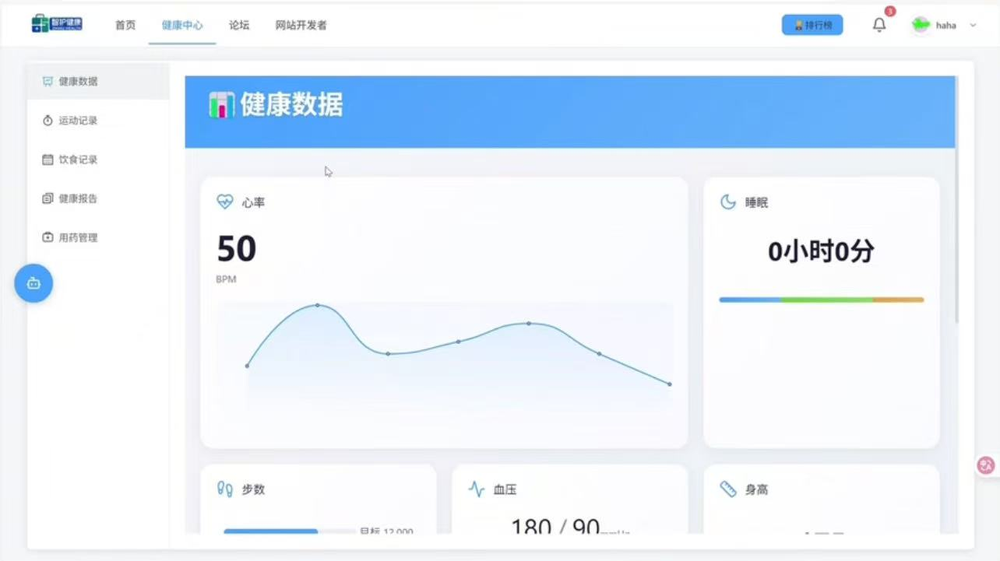

<br><br>

#### 📊 Health Metrics Detail
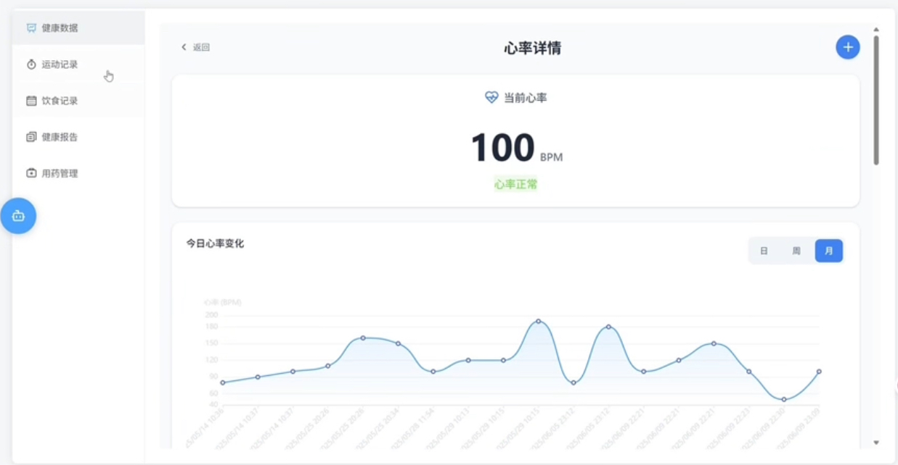

<p><i>支持 BMI、血压、心率、睡眠质量等多项健康指标的详细追踪与分析</i></p>

<br><br>

#### 🤖 AI Health Assistant
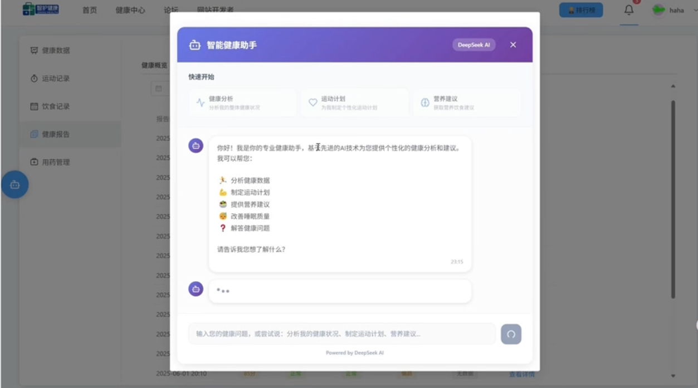

<br><br>

#### 💬 Community Forum
<table>
  <tr>
    <td width="50%">
      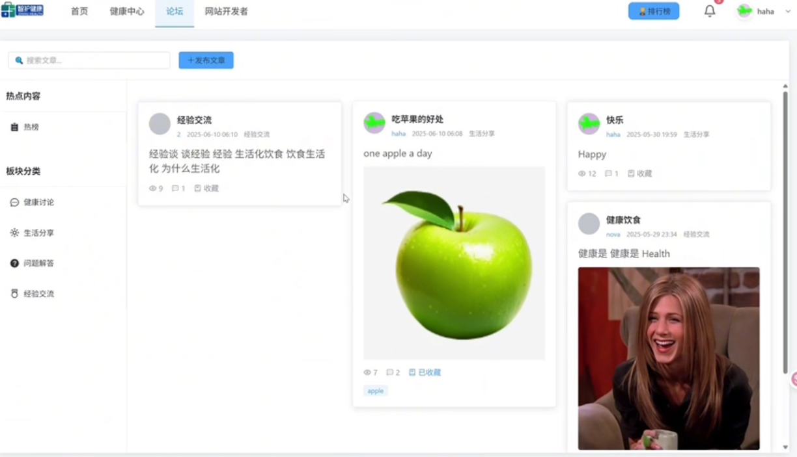
      <p align="center"><b>社区文章列表</b></p>
    </td>
    <td width="50%">
      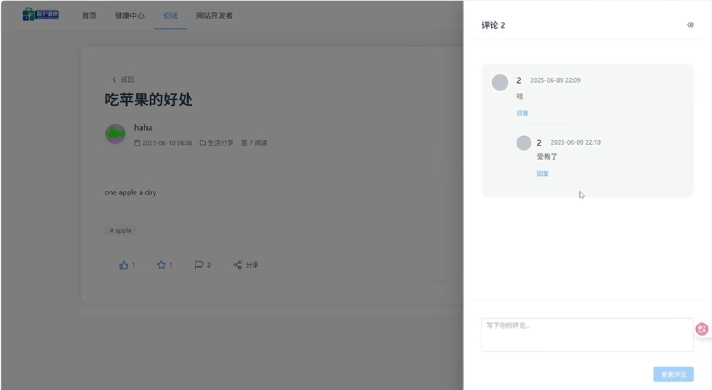
      <p align="center"><b>文章详情页</b></p>
    </td>
  </tr>
</table>
<br>

#### ✏️ Rich Text Editor
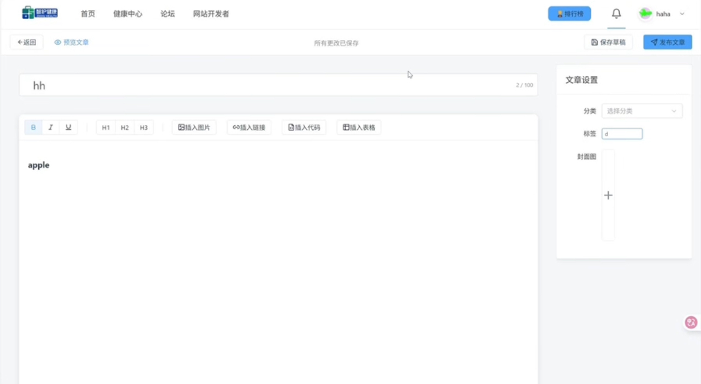

<br><br>

#### 💊 Medication Reminder
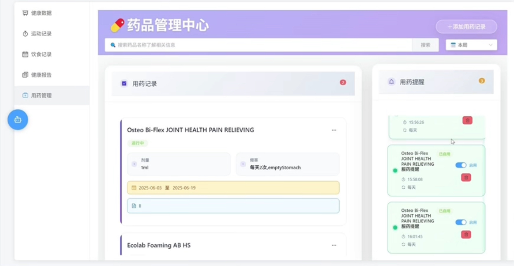

<br><br>

#### 🍎 Diet & Nutrition Tracking
<table>
  <tr>
    <td width="50%">
      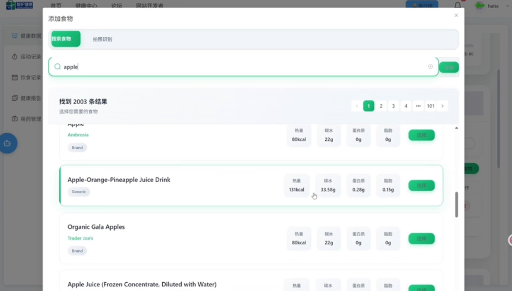
      <p align="center"><b>饮食记录</b></p>
    </td>
    <td width="50%">
      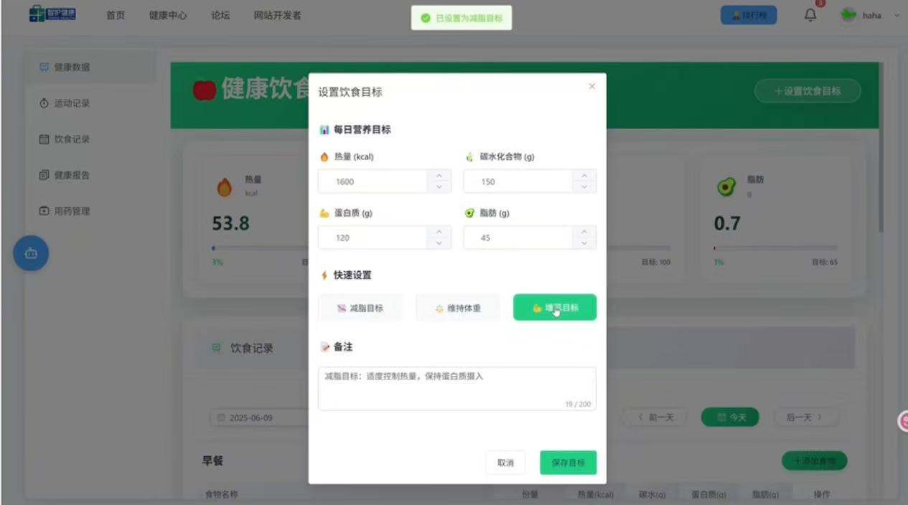
      <p align="center"><b>营养分析</b></p>
    </td>
  </tr>
</table>


<br>

#### 🏃 Exercise Records
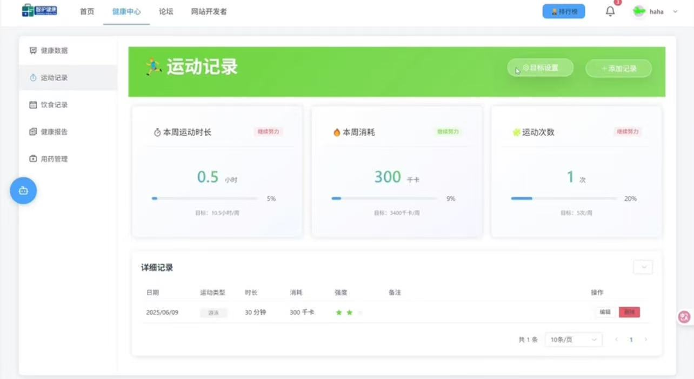

<br><br>

#### 👤 User Profile Management
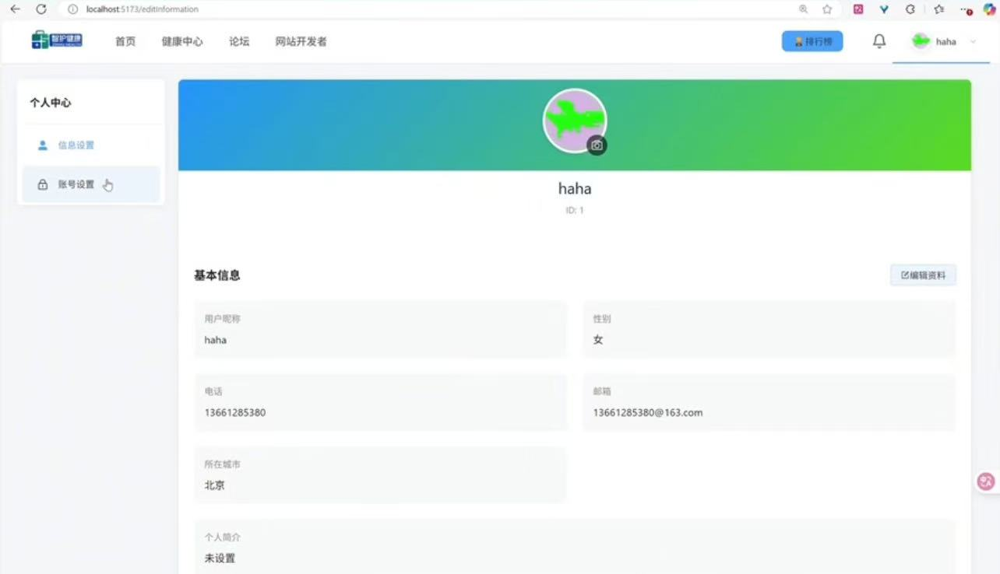

</div>

### Project Structure

```
healthplatform_front/
├── src/
│   ├── views/                     # Page components
│   │   ├── auth/                  # Authentication pages
│   │   │   ├── Login.vue
│   │   │   └── Register.vue
│   │   ├── home/                  # Home page
│   │   │   └── Home.vue
│   │   ├── health/                # Health data module
│   │   │   ├── healthData.vue     # Health overview
│   │   │   └── detail/            # Detailed pages
│   │   │       ├── BMI.vue
│   │   │       ├── Weight.vue
│   │   │       ├── BloodPressure.vue
│   │   │       ├── HeartRate.vue
│   │   │       ├── Height.vue
│   │   │       ├── Sleep.vue
│   │   │       └── Steps.vue
│   │   ├── medicine/              # Medication module
│   │   │   └── MedicineReminder.vue
│   │   ├── exercise/              # Exercise module
│   │   │   └── ExerciseRecord.vue
│   │   ├── forum/                 # Community module
│   │   │   ├── Articles.vue       # Article list
│   │   │   └── ArticleDetail.vue  # Article detail
│   │   └── diet/                  # Diet tracking
│   │
│   ├── components/                # Reusable components
│   │   ├── Header.vue             # Page header
│   │   ├── Footer.vue             # Page footer
│   │   ├── Navigation.vue         # Navigation menu
│   │   ├── Bot.vue                # AI chatbot
│   │   └── DraggableBubble.vue    # Floating AI assistant
│   │
│   ├── router/                    # Routing configuration
│   │   └── index.js
│   │
│   ├── store/                     # State management (Vuex)
│   │   └── index.js
│   │
│   ├── api/                       # API service modules
│   │   ├── article.js             # Article APIs
│   │   ├── health.js              # Health data APIs
│   │   ├── diet.js                # Diet APIs
│   │   ├── medicine.js            # Medicine APIs
│   │   ├── exercise.js            # Exercise APIs
│   │   └── user.js                # User APIs
│   │
│   ├── utils/                     # Utility functions
│   │   ├── request.js             # Axios wrapper
│   │   ├── date.js                # Date utilities
│   │   └── flexible.js            # Mobile adaptation
│   │
│   ├── assets/                    # Static assets
│   │   ├── images/                # Images
│   │   ├── styles/                # Global styles
│   │   └── icons/                 # Icon resources
│   │
│   ├── App.vue                    # Root component
│   └── main.js                    # Application entry
│
├── public/                        # Public assets
├── package.json                   # Dependencies
├── vite.config.js                # Vite configuration
└── README.md                      # Project documentation
```

### Core Features Implementation

#### 1. Health Data Dashboard

- Real-time display of multiple health metrics
- Interactive data visualization with ECharts
- Historical trend analysis with date range selection
- Health status indicators with color coding
- Quick navigation to detailed metric pages

#### 2. AI Health Assistant

- Draggable floating chat bubble interface
- Context-aware health Q&A
- Personalized health recommendations
- Multi-turn conversation support
- Integration with backend AI service

#### 3. Community Forum

- Article list with search and filtering
- Rich text editor for article creation (TinyMCE)
- Multi-level comment system
- Social interactions (likes, favorites, shares)
- Image upload support
- User-friendly markdown rendering

#### 4. Real-time Features

- WebSocket connection for instant notifications
- Automatic reconnection mechanism
- Real-time medication reminders
- Live health alert notifications
- Status indicators for connection state

#### 5. Responsive Design

- Mobile-first approach with rem-based layout
- Flexible.js for precise mobile adaptation
- Touch-friendly interactions
- Optimized for various screen sizes
- Progressive Web App (PWA) ready

#### 6. Performance Optimization

- Debounced search for better performance
- Lazy loading for routes and components
- Optimized bundle size with Vite
- Efficient state management
- Image lazy loading

### Quick Start

#### Prerequisites

- Node.js 16+ or higher
- npm 8+ or yarn 1.22+
- Backend server running on `http://localhost:8088`

#### Installation Steps

1. **Clone the repository**

```bash
git clone https://github.com/nova728/health-platform-front.git
cd health-platform-front
```

2. **Install dependencies**

```bash
npm install
# or
yarn install
```

3. **Configure environment variables**
   Create a `.env` file in the root directory:

```env
# API base URL
VITE_API_BASE_URL=http://localhost:8088

# WebSocket URL
VITE_WS_URL=ws://localhost:8088

# Enable dev tools
VITE_DEV_TOOLS=true
```

4. **Start development server**

```bash
npm run dev
# or
yarn dev
```

The application will be available at `http://localhost:5173`

5. **Build for production**

```bash
npm run build
# or
yarn build
```

6. **Preview production build**

```bash
npm run preview
# or
yarn preview
```

### API Integration

The frontend communicates with the backend through RESTful APIs and WebSocket connections.

**HTTP Client Setup (request.js):**

```javascript
import axios from 'axios'

const request = axios.create({
  baseURL: import.meta.env.VITE_API_BASE_URL,
  timeout: 10000
})

// Request interceptor
request.interceptors.request.use(
  config => {
    const token = localStorage.getItem('token')
    if (token) {
      config.headers['Authorization'] = `Bearer ${token}`
    }
    return config
  },
  error => Promise.reject(error)
)

// Response interceptor
request.interceptors.response.use(
  response => response.data,
  error => {
    // Handle errors
    return Promise.reject(error)
  }
)
```

**WebSocket Connection:**

```javascript
const connectWebSocket = () => {
  const userId = localStorage.getItem('userId')
  const ws = new WebSocket(`${VITE_WS_URL}/notification/${userId}`)
  
  ws.onopen = () => console.log('WebSocket connected')
  ws.onmessage = (event) => handleMessage(JSON.parse(event.data))
  ws.onerror = (error) => console.error('WebSocket error:', error)
  ws.onclose = () => setTimeout(connectWebSocket, 5000)
}
```

### State Management

The application uses Vuex for centralized state management:

```javascript
// store/index.js
import { createStore } from 'vuex'

export default createStore({
  state: {
    user: null,
    healthData: [],
    notifications: []
  },
  mutations: {
    SET_USER(state, user) {
      state.user = user
    },
    SET_HEALTH_DATA(state, data) {
      state.healthData = data
    }
  },
  actions: {
    async fetchHealthData({ commit }, userId) {
      const data = await healthAPI.getHealthData(userId)
      commit('SET_HEALTH_DATA', data)
    }
  }
})
```

### Routing Configuration

Vue Router is used for navigation with route guards for authentication:

```javascript
// router/index.js
import { createRouter, createWebHistory } from 'vue-router'

const router = createRouter({
  history: createWebHistory(),
  routes: [
    {
      path: '/',
      name: 'Home',
      component: () => import('@/views/home/Home.vue')
    },
    {
      path: '/health',
      name: 'Health',
      component: () => import('@/views/health/healthData.vue'),
      meta: { requiresAuth: true }
    }
  ]
})

// Navigation guard
router.beforeEach((to, from, next) => {
  if (to.meta.requiresAuth && !localStorage.getItem('token')) {
    next('/login')
  } else {
    next()
  }
})
```

### Component Architecture

**Composition API Pattern:**

```vue
<script setup>
import { ref, computed, onMounted } from 'vue'
import { useStore } from 'vuex'

const store = useStore()
const healthData = ref([])
const loading = ref(false)

const latestData = computed(() => 
  healthData.value[0] || {}
)

const fetchData = async () => {
  loading.value = true
  try {
    healthData.value = await api.getHealthData()
  } finally {
    loading.value = false
  }
}

onMounted(fetchData)
</script>

<template>
  <div v-loading="loading">
    <el-card>{{ latestData }}</el-card>
  </div>
</template>
```

### Styling Guidelines

**CSS Architecture:**

- Global styles in `assets/styles/`
- Component-scoped styles using `<style scoped>`
- CSS variables for theming
- BEM naming convention for classes

**Responsive Design:**

```scss
// Mobile first approach
.container {
  padding: 1rem;
  
  @media (min-width: 768px) {
    padding: 2rem;
  }
  
  @media (min-width: 1024px) {
    padding: 3rem;
    max-width: 1200px;
    margin: 0 auto;
  }
}
```

### Development Guidelines

#### Code Style

- Use Vue 3 Composition API with `<script setup>`
- Follow Vue.js official style guide
- Use TypeScript for better type safety (optional)
- Write descriptive component and variable names
- Keep components small and focused

#### Best Practices

1. **Component Design**: Create reusable, single-purpose components
2. **Props Validation**: Always validate props with proper types
3. **Event Handling**: Use descriptive event names
4. **Error Handling**: Implement proper error boundaries
5. **Performance**: Use `v-memo` and `v-once` where appropriate

#### Testing

```bash
# Run unit tests
npm run test:unit

# Run e2e tests
npm run test:e2e

# Generate coverage report
npm run test:coverage
```

### Build & Deployment

#### Production Build

```bash
# Build for production
npm run build

# Output will be in the 'dist' directory
```

#### Deployment Options

**1. Static Hosting (Netlify, Vercel):**

- Connect your GitHub repository
- Set build command: `npm run build`
- Set publish directory: `dist`

**2. Nginx Deployment:**

```nginx
server {
    listen 80;
    server_name your-domain.com;
    root /path/to/dist;
    index index.html;

    location / {
        try_files $uri $uri/ /index.html;
    }

    location /api {
        proxy_pass http://localhost:8088;
        proxy_set_header Host $host;
        proxy_set_header X-Real-IP $remote_addr;
    }
}
```

**3. Docker Deployment:**

```dockerfile
FROM node:16-alpine as build
WORKDIR /app
COPY package*.json ./
RUN npm install
COPY . .
RUN npm run build

FROM nginx:alpine
COPY --from=build /app/dist /usr/share/nginx/html
COPY nginx.conf /etc/nginx/conf.d/default.conf
EXPOSE 80
CMD ["nginx", "-g", "daemon off;"]
```

### Browser Support

- Chrome (latest)
- Firefox (latest)
- Safari (latest)
- Edge (latest)
- Mobile browsers (iOS Safari, Chrome Mobile)

### Performance Optimization

1. **Code Splitting**: Automatic route-based splitting with Vite
2. **Tree Shaking**: Remove unused code in production builds
3. **Asset Optimization**: Compress images and use modern formats
4. **Lazy Loading**: Defer loading of non-critical components
5. **Caching**: Implement proper cache strategies

### Troubleshooting

**Common Issues:**

1. **CORS errors**: Ensure backend has proper CORS configuration
2. **WebSocket connection fails**: Check firewall and proxy settings
3. **Build errors**: Clear node_modules and reinstall dependencies
4. **Performance issues**: Check for unnecessary re-renders and optimize computed properties

### Contributing

We welcome contributions! Please follow these guidelines:

1. Fork the repository
2. Create a feature branch (`git checkout -b feature/NewFeature`)
3. Follow the code style guidelines
4. Write tests for new features
5. Commit with clear messages (`git commit -m 'Add NewFeature'`)
6. Push to your branch (`git push origin feature/NewFeature`)
7. Open a Pull Request

### Resources

- [Vue 3 Documentation](https://vuejs.org/)
- [Element Plus Documentation](https://element-plus.org/)
- [ECharts Documentation](https://echarts.apache.org/)
- [Vite Documentation](https://vitejs.dev/)

### License

This project is licensed under the MIT License - see the [LICENSE](LICENSE) file for details.

### Contact

Project Link: [https://github.com/nova728/health-platform-front](https://github.com/nova728/health-platform-front)

---